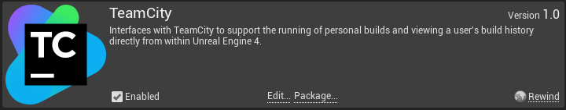
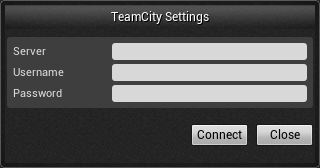
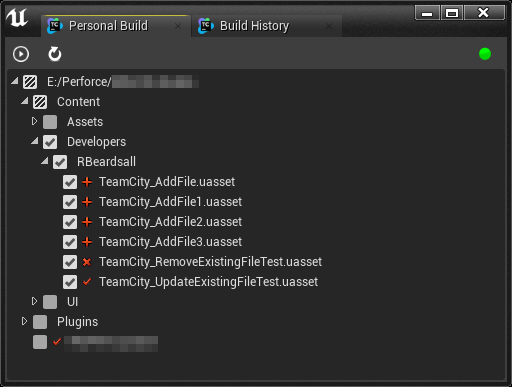
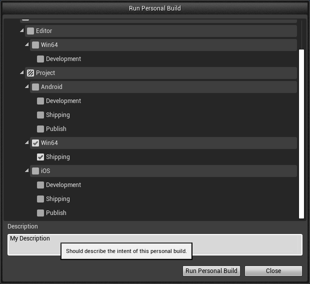
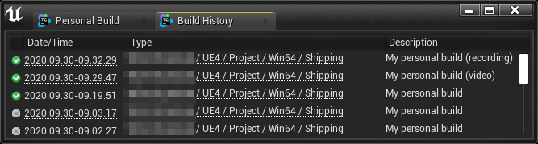

# Unreal Engine TeamCity Plugin

To use the REWIND TeamCity Unreal Engine Plugin, you must first make sure that you have the Plugin installed as a project level plugin by dropping it in the Plugins directory adjacent to your .uproject.

To then enable the plugin, simply go to Edit -> Plugins inside of Unreal and go to the Rewind tab and check 'enabled'. You will need to restart Unreal before you can use the plugin.

Once you have validated that the TeamCity plugin is enabled, you can now access the TeamCity submenu under 'Window' in the editor. There are two menu items - Personal Build and Build History.

### Personal Build tab

The Personal Build tab is where you can select the changes you wish to commit to a personal build, and run the personal build. You will first need to ensure you are connected to source control in Unreal, and then click on the red button at the top right of the tab. This will open the TeamCity settings window. Here, you should type in the server address and then your TeamCity login credentials.

After clicking on Connect, you should be greeted with a green icon, and a list of changes (if any) that you have made locally that are tracked by source control. Here, you can select any of the changes you wish to commit to a personal build, then click on the 'run' button at the top left to start a new personal build. If you make any new changes and they are not being reflected in this window, make sure that they are saved and tracked by source control, and click the 'refresh' button to refresh the view.

When you click the 'run' button, you should be greeted with a view of all of the possible build configurations for your changes. You can select as many as you like, to test your changes on multiple configurations. You should then type a description explaining your changes (this does not need to follow the same pattern as usual commits as your changes will not be integrated to the main branch, however it should be descriptive enough for you to be able to understand the commit at a glance), and then hit 'Run Personal Build'.

When you click Run Personal Build, the window will close and a build notification will appear for each of the build configurations you've selected. You can open the Team City build log for each of these by clicking on the 'Show TeamCity Build log' link on the notification. This will open a browser window pointing at the build page for your personal build. Here you can track the status of your build on the build agent as you would if this was a normal Team City triggered build. Alternatively, you can leave the build(s) running and continue working. You will be notified again on success/failure of the build.

You can also cancel the build by clicking the 'cancel' button.

### Build History tab

The Build History tab surfaces all of the personal builds that you have triggered for this project. The view is filtered to only show your own personal builds, and displays the status of the build on the left (success/cancelled/failed). You can click on either the time started or the build type links to open the build page for any of these builds.

### Known Issues

We built the tool to use internally at REWIND, with the focus on being integrated with Perforce (our version control system of choice), however, we built it with the mindset that it could easily be extended to support other VCS, like GitHub, Plastic etc. If you want to extend the plugin to support your preferred version control system, take a look at the 'TeamCityGetBuildConfigs::GetSupportedSourceControlProvider' as a good starting point.
